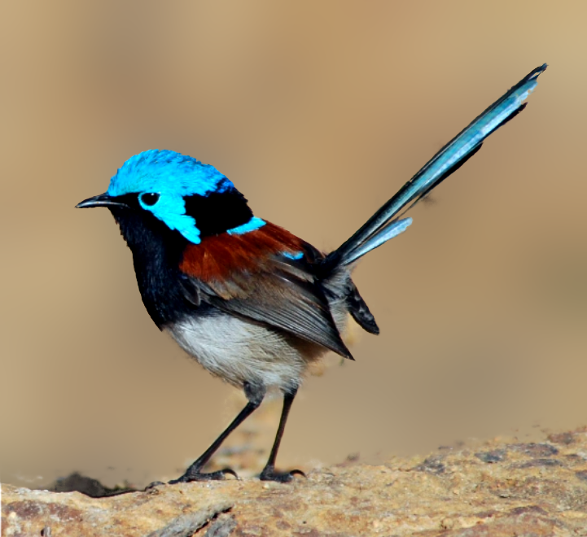

# Single image deep defocus classification and its applications. 

This is the official repository for the paper  "Single image deep defocus clasification and its applications." by Galetto, F. and Deng, G. Submitted for review at IEEE Open Journal of Signal Processing. 
 

[>> Download the pretrained model from here <<](https://drive.google.com/file/d/1sSNHBcmpIZ3huboG0EFe16QWUCFDfuup/view?usp=sharing)

[>> Download the dataset from here <<](https://drive.google.com/file/d/1QrVuo97xJFdkyp3zc98AgGp1wkxzdeHA/view?usp=sharing)

## Defocus blur estimation

    
    

## Refinement

    
    

## Defocus magnification

    
    
    

